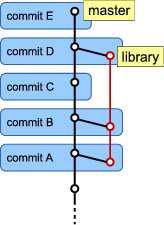
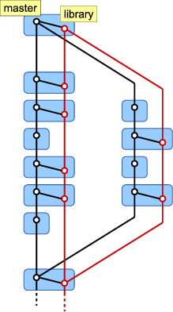
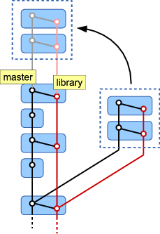

Exploring an alternative to git-subtree
#######################################

:tags: git

.. contents::

When you want to include external code in your git repository, for example a
third-party library or code shared with another team, there are two popular
options: git-submodule and git-subtree. Unfortunately both suffer from
some problems and this led me to start thinking about an alternative way to
handle external repositories.

I will first summarize how git-submodule and git-subtree work and discuss their
drawbacks. I will then introduce an alternative to these, "git-subrepo" and
present a (partial) proof-of-concept implementation. In the following, we assume
a single submodule/subtree/subrepo.

git-submodule
=============

Submodules are the officially supported way of including external repositories;
git-submodule is included with every git installation. A submodule is
basically a pointer to a commit of an external git repository. This model works
well when you want to include a third-party library in your project that
*only occasionally needs to be updated*.

On the other hand, if you use a submodule for a tightly-coupled library to
which you will often be making changes, you will find that submodules are not
the answer. In this use case, you will simultaneously be making changes to your
top-level project and the library. When the time has come to commit these
changes, you first need to commit your changes in the submodule, then do the
same in your top-level project. Oh, and make sure you push the changes to the
submodule before committing and pushing the top-level changes or other people
will run into trouble when pulling in your top-level commit. Things get even
more exciting when you want to push that submodule commit afterwards to fix
things, only to find out that someone sneaked in a commit in the meantime! Now
you'll have to create a new commit on the top-level project to point it to your
rebased commit, hah! In short: too much of a hassle and far too easy to make a
mess.

If that's not enough to convince you, you should try branching with this setup.
You'll have to manually branch (and later merge) each of your submodules when
you create a new branch.

In the past, I have worked with a git repository containing a dozen
tightly-coupled submodules for code-sharing with other teams. Needless to say,
it didn't take very long to realize that submodules are not suited for that use
case.

git-subtree
===========

git-subtree__ avoids most of the problems submodules suffer from. During everyday
work, you won't have to worry about a thing, as git-subtree is only needed when
interfacing with external repositories. So, most of the time you are working
with a single repository; the library is simply included in your repository
as a subdirectory. That means that branching is also transparent. This is
infinitely more comfortable than mucking about with submodules.

.. __: https://github.com/apenwarr/git-subtree/blob/master/git-subtree.txt

At some point you can choose to have git-subtree extract the changes to your
library from the commit history. This will create a new branch with a commit for
each commit of the top-level project that includes changes to the library. The
root directory of this new branch is equal to the subdirectory where the library
resides. The new branch can then be pushed to the library's remote, where it can
be merged with other branches. After all, that's the point of having a submodule
or a subtree.

Unfortunately, splitting out these subtree changes `can take a long time`__. And
unless you use the ``--rejoin`` option, git-subtree needs to perform this splitting
over and over for all commits in your history on each split. The ``--rejoin`` option
merges the new subtree branch back into the main project's branch, duplicating
the existing commits. While this raises no technical worries, your history will
be complicated unnecessarily.

.. __: http://stackoverflow.com/questions/16134975/reduce-increasing-time-to-push-a-subtree

.. New commits on fetched from the remote can also be merged back into the main
    project's branch (using the subtree merge strategy, hence the name git-subtree).

The alternative, git-subrepo
============================

It would be better if changes were split between the main project and the
library at commit time, basically yielding two actual commits. The main
project commit would then simply (subtree-)merge in the
library's commit. This way the library's commit can be used as-is for pushing to
the library remote. Let's illustrate this with a figure.

   Subrepo commit

The *master* branch (left) holds the commits of the main project and the *library*
branch (right) holds the commits of the library (shown in red). Let's refer to
the latter as the *subrepo branch* and *subrepo commits* for lack of better
terms. The "logical commits" C and E contain no changes to the library; only a
single commit is created. Commits A, B and D do make changes to the library, so
two actual commits are created for each logical commit.

Commit A is the commit that introduces the subdirectory where the library
resides, so this yields the first commit of the library branch. As with
git-subtree, an existing library branch could be subtree-merged into the master
branch first, in which case we would build on that history.

Note that the library branch is completely independent of the master branch, so
it can be pushed to the library's remote at any point in time. There is no need
for splitting or rejoining as is the case with git-subtree.

Aside from splitting up commits, we also need to take special care when merging
and rebasing. The figure below illustrates how **merges** should be handled. The
branched-off subrepo commits first need to be merged into the *library* branch.
As with the commit-splitting above, the resulting subrepo merge-commit is
referenced as a parent of the merge-commit on the main *master* branch.

   Subrepo merge

**Rebasing** is fairly straight-forward. A subrepo commit is rebased onto the
*library* subrepo branch. The corresponding main-line commit is rebased
onto the *master* branch and references the rebased subrepo commit as a parent.

   Subrepo rebase

Proof of concept
----------------

.. I have to say that I was pleased to find that the
    content-addressable filesystem that lies at the core of git
    has a very simple and elegant design. I was not prepared for that, after
    witnessing the small disaster that the git command line interface is.

I hacked together `post-commit and post-merge hook scripts`__ to implement some
of the functionality discussed above. These hooks expect you specify the subrepo
directories in a ``.gitsubrepos`` file in the root of your repository. Each
subrepo directory should be specified on its own line.

.. __: https://github.com/brechtm/git-subrepo

The post-commit hook should work fairly well. Since this is a *post*-commit
script, you simply perform your commit as usual. The hook script will create the
subrepo commits for each of the subrepos with changes, cloning the commit
metadata (timestamp, author) from your commit. A new main-line commit will also
be created that references the subrepo commit as a parent. After finishing, git
will still report the SHA-1 of the original commit though, so don't let that
fool you.

Note that branching is handled transparently. The parent for the split-off
subrepo commit is found by walking the history down to the last commit that
merges in a subrepo commit. Branches have no influence on this.

During merging, you handle conflicts as usual, after which the post-merge hook
will try to create merge commits for each of the subrepos. In its current state,
the hook will produce some unexpected results in some situations though.

I have not yet attempted to write a hook to handle rebases and amend-commits.
This will almost require a post-rewrite__ hook.

.. __: https://www.kernel.org/pub/software/scm/git/docs/githooks.html#_post_rewrite

Probl... err, challenges
------------------------

Assuming it is possible to write a post-rewrite script to handle rebasing and
amend-commits, I believe subrepos could be a better alternative to git-subtree.
Unfortunately, I also see some problems with this solution.

First, I don't think hooks are the correct way to implement subrepos, but I
have no idea how to go about it otherwise. I'm not aware of any other git
features that allow plugging into the commit, merge and rebase processes. The
alternative is to require the user to use different commands for performing
these operations, which is something I want to avoid.

Second, the way the history with subrepo commits is displayed in git-log and
gitk (and other graphical git front-ends) leaves something to be desired. For
instance, if you commit changes to N subrepos you will end up with N+1 commits,
which clutters the commit history even for small N. Take a look at this `sample
repository`__.

.. __: https://github.com/brechtm/git-subrepo-test

Also, each commit with subrepo changes will be displayed as a merge commit. Gitk
does not show changes in the subrepo if this commit only merges in a single
subrepo commit. When multiple subrepo commits are merged in, gitk does show the
changes, but as a complicated N-way merge diff.

Ideally, gitk should be made aware of subrepos; it should group all subrepo
commits together with the main commit and display it as a single entry. I feel
this is a fair price to pay for proper, first-class subrepositories support.

Random Ideas
------------

For future reference, here are some ideas for git-subrepo.

1. When a commit includes changes to one or more subrepos, the commit message
   template should include sections for each subrepo. This way the user can
   specify the commit message for each of the subrepo commits. This is much
   better than the current behaviour where the same commit message is used for
   the main commit and all subrepo commits. This will require a
   prepare-commit-msg__ hook.

2. git-subrepo should create branches to track the subrepos. They could have the
   following format::

      subrepo/<subrepo name>/<HEAD branch name>

   This allows the user to easily inspect the history of subrepos separately.

.. __: https://www.kernel.org/pub/software/scm/git/docs/githooks.html#_prepare_commit_msg

Comments on `Hacker News`_ and `Reddit`_

.. _Hacker News: https://news.ycombinator.com/item?id=7286485
.. _Reddit: http://www.reddit.com/r/git/comments/1ypout/exploring_an_alternative_to_gitsubtree/

